# 🏃 Human Activity Recognition using PAMAP2

> Transforming raw wearable sensor data into activity predictions using feature engineering, signal processing, and machine learning.


---

## 📖 Overview

This project builds upon the preprocessing pipeline developed in **Exercise 1**, where raw PAMAP2 sensor streams were segmented into fixed-size sliding windows.

In this exercise, statistical and frequency-domain features are extracted from each window and used to train a **K-Nearest Neighbors (KNN)** classifier for Human Activity Recognition (HAR).

The project explores:

* 📊 Feature Engineering
* 🔍 Exploratory Feature Visualization
* 🤖 KNN Classification
* 🔄 Stratified 5-Fold Cross Validation
* ⚖️ Class Imbalance Analysis
* 📈 Performance Evaluation
* 🎯 Dataset Balancing through Random Undersampling

---

## 🏗️ Pipeline

```text
Raw Sensor Signals
        │
        ▼
Window Segmentation
(Exercise 1)
        │
        ▼
Feature Extraction
        │
        ▼
Feature Visualization
        │
        ▼
KNN Classification
        │
        ▼
Cross Validation
        │
        ▼
Confusion Matrix Analysis
        │
        ▼
Class Balancing
        │
        ▼
Re-Training & Evaluation
```

---

# 🧠 Feature Engineering

Human activities generate unique motion patterns which can be captured through carefully designed statistical and frequency-domain features.

For each segmented window:

[
Magnitude = \sqrt{x^2+y^2+z^2}
]

The following features were extracted:

| Feature               | Description                    |
| --------------------- | ------------------------------ |
| Mean                  | Average acceleration magnitude |
| Standard Deviation    | Signal variability             |
| Range                 | Maximum − Minimum              |
| Interquartile Range   | Robust spread measurement      |
| Maximum FFT Component | Dominant frequency response    |
| Mean FFT Magnitude    | Overall spectral energy        |

These six features form the final feature vector used for classification.

---

# 📊 Exploring the Feature Space

Before training the classifier, the extracted features were visualized to evaluate how well different activities separate in feature space.

## Feature Pair 1

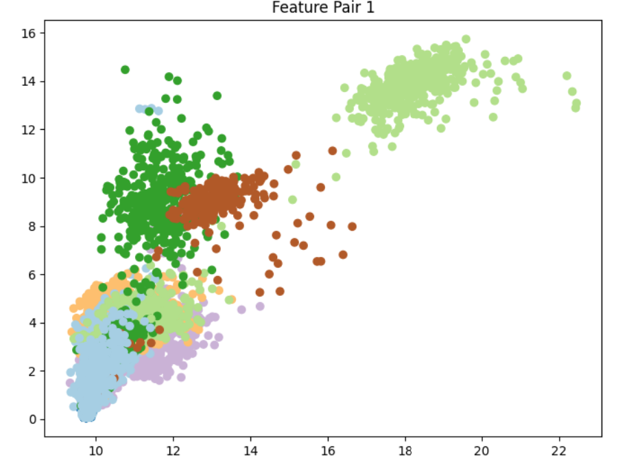

Distinct clusters emerge naturally, indicating that the extracted statistical features already capture meaningful differences between several activities.

---

## Feature Pair 2

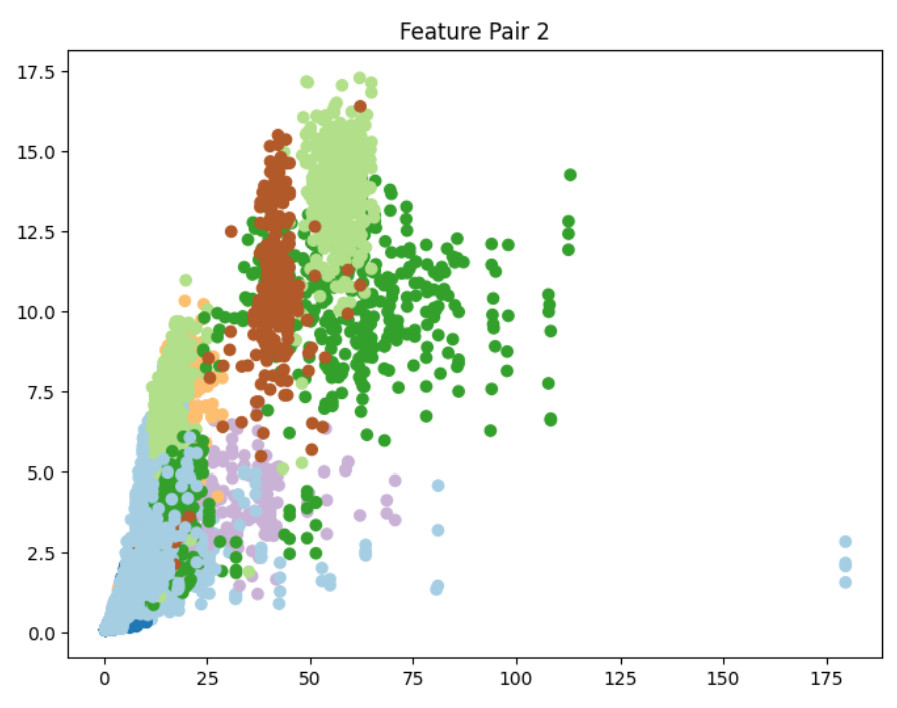

The separation becomes even more pronounced for certain activities, suggesting that frequency-domain information contributes significantly to classification performance.

---

## Feature Pair 3

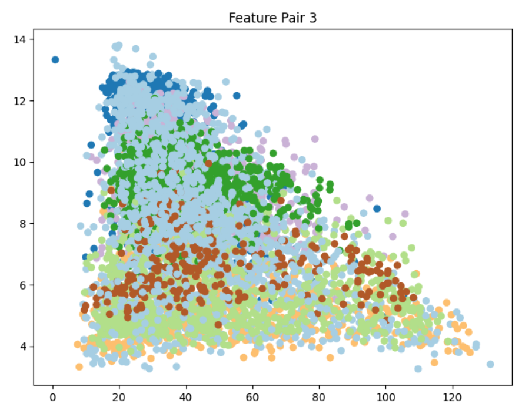

While some classes remain distinguishable, several activities overlap substantially, highlighting the challenges of Human Activity Recognition using handcrafted features alone.

---

# 🤖 Classification Model

## K-Nearest Neighbors (KNN)

A KNN classifier was trained using the extracted feature vectors.

```python
KNeighborsClassifier(
    n_neighbors=5
)
```

### Validation Strategy

```text
Stratified 5-Fold Cross Validation
```

Stratification ensures that each fold preserves the original class distribution and provides a more reliable estimate of model performance.

---

# 🚀 Results on Original Dataset

## Classification Accuracy

```text
59.47%
```

---

## Confusion Matrix

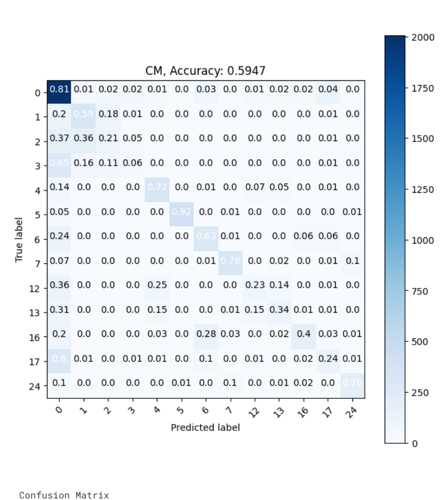

The classifier performs well on activities with distinctive movement signatures while struggling with activities exhibiting similar motion characteristics.

Several classes achieve strong recognition rates, whereas others are frequently confused due to overlapping movement patterns.

---

## Detailed Confusion Matrix Values

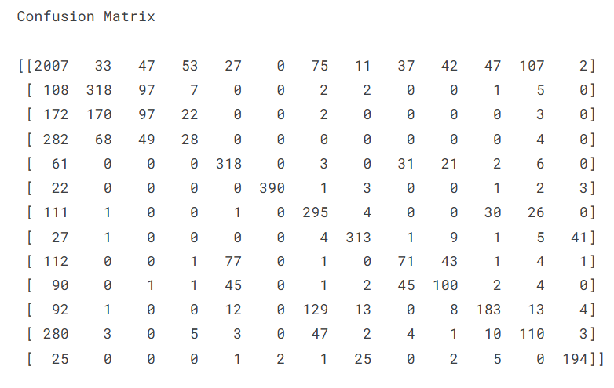

The confusion matrix provides a deeper view of prediction behavior and highlights which activities are most frequently misclassified.

---

## Class Distribution

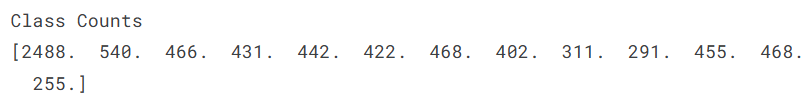

### Observation

The dataset exhibits significant class imbalance.

Certain activities contain substantially more samples than others, leading the classifier to favor majority classes during training.

---

## Smallest Activity Class

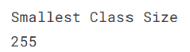

The least represented activity contains:

```text
255 Samples
```

This value becomes the reference point for balancing the dataset.

---

# ⚖️ Tackling Class Imbalance

To reduce bias introduced by uneven class distributions, random undersampling was performed.

Every activity class was reduced to match the size of the smallest class.

```text
255 Samples per Activity
```

---

## Balanced Dataset Distribution

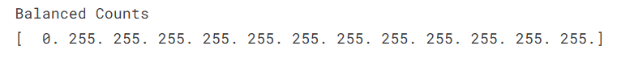

After balancing, every activity contributes equally to the training process.

This allows the classifier to learn a more representative decision boundary across all classes.

---

# 📈 Feature Space After Balancing

## Balanced Feature Pair 1

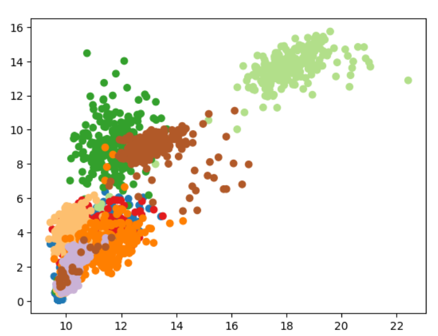

---

## Balanced Feature Pair 2

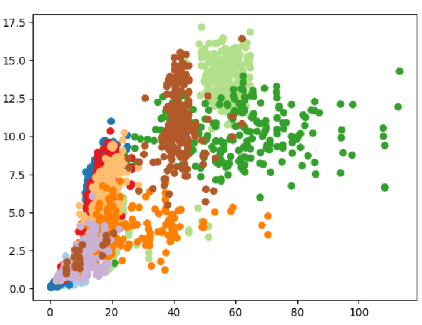

---

## Balanced Feature Pair 3

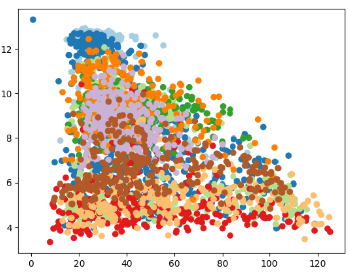

### Observation

Balancing produces a more uniform representation of activities within the feature space and reduces dominance by majority classes.

---

# 🎯 Results on Balanced Dataset

## Classification Accuracy

```text
55.10%
```

---

## Balanced Confusion Matrix

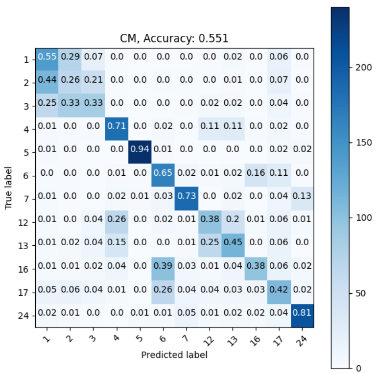

The classifier becomes noticeably fairer across activity classes.

Although overall accuracy decreases slightly, minority activities receive substantially improved representation during training.

---

## Detailed Balanced Confusion Matrix

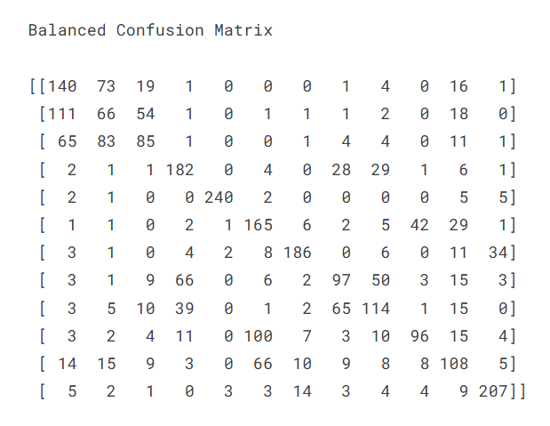

The resulting predictions are more evenly distributed across classes, reducing majority-class bias.

---

# 📊 Performance Comparison

| Metric                        | Original Dataset | Balanced Dataset |
| ----------------------------- | ---------------- | ---------------- |
| Accuracy                      | 59.47%           | 55.10%           |
| Samples per Class             | Variable         | 255              |
| Class Bias                    | High             | Reduced          |
| Fairness Across Classes       | Lower            | Higher           |
| Minority Class Representation | Limited          | Improved         |

---

# 🔍 Key Insights

### Original Dataset

✅ Higher overall accuracy

❌ Strong influence of majority classes

❌ Minority activities often overlooked

---

### Balanced Dataset

✅ More equitable learning across activities

✅ Improved representation of minority classes

✅ Fairer evaluation

❌ Slight reduction in overall accuracy

---

# 💡 What This Project Demonstrates

This project showcases an end-to-end Human Activity Recognition workflow involving:

* Time-Series Feature Engineering
* Signal Processing using FFT
* Machine Learning Classification
* Stratified Cross Validation
* Confusion Matrix Analysis
* Handling Real-World Class Imbalance
* Model Evaluation & Performance Analysis

These concepts form the foundation of many modern applications including:

* Smart Wearables
* Fitness Tracking Systems
* Healthcare Monitoring
* Industrial Worker Monitoring
* Human-Centered AI Systems

---

# 🛠️ Tech Stack

### Languages & Libraries

* Python
* NumPy
* Matplotlib
* Scikit-Learn

### Machine Learning

* K-Nearest Neighbors (KNN)
* Stratified K-Fold Cross Validation
* Feature Engineering

### Signal Processing

* Accelerometer Magnitude Computation
* Fast Fourier Transform (FFT)
* Frequency-Domain Analysis

### Dataset

* PAMAP2 Physical Activity Monitoring Dataset

---

# 🎓 Learning Outcomes

Through this project I gained hands-on experience with:

* Human Activity Recognition (HAR)
* Feature Extraction from Sensor Data
* Statistical Signal Analysis
* Frequency-Domain Feature Engineering
* Machine Learning Classification
* Cross Validation Techniques
* Confusion Matrix Interpretation
* Dataset Balancing Strategies
* Model Performance Evaluation

---

## ⭐ Final Takeaway

While the original dataset achieved the highest accuracy, balancing the dataset produced a more reliable and equitable classifier.

This experiment highlights an important lesson in machine learning:

> **A model with slightly lower accuracy can often be more useful if it performs fairly across all classes.**

---

⭐ If you found this project interesting, consider starring the repository.
