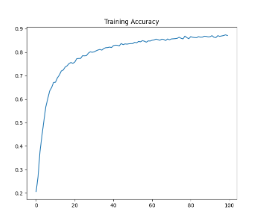
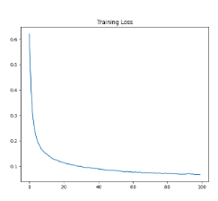
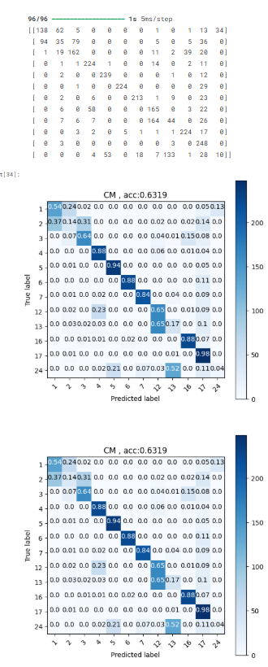
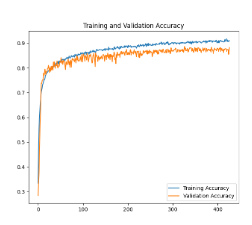
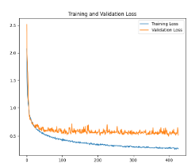
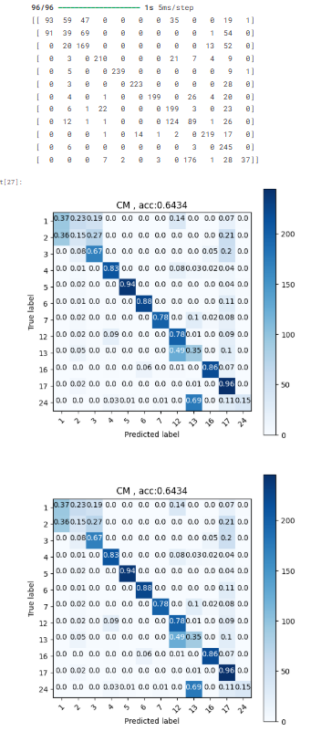

# 🏃 ActivitySense: Deep Learning for Human Activity Recognition

> Building an end-to-end Human Activity Recognition pipeline using wearable sensor data, convolutional neural networks, validation-driven training, and model optimization.


---

## 🚀 Project Overview

Human Activity Recognition (HAR) is one of the foundational problems in wearable AI, healthcare analytics, and context-aware systems.

In this project, a Convolutional Neural Network (CNN) was trained directly on raw accelerometer signals from the PAMAP2 dataset to recognize human activities without relying on handcrafted statistical features.

Unlike traditional machine learning approaches, the network automatically learns motion representations from raw sensor streams.

---

## 🧠 What Makes This Interesting?

Most HAR projects stop at feature engineering and classical machine learning.

This project explores:

✅ Raw Sensor Learning

✅ Deep Neural Networks for Time Series

✅ Class Balancing Techniques

✅ Validation-Based Training

✅ Early Stopping

✅ Checkpoint-Based Model Selection

✅ Subject-Independent Evaluation

---

## ⚙️ End-to-End Pipeline

```text
Wearable Sensor Signals
           │
           ▼

 Window Segmentation
           │
           ▼

 Dataset Balancing
           │
           ▼

     CNN Training
           │
           ▼

 Feature Learning
           │
           ▼

 Activity Prediction
           │
           ▼

 Performance Evaluation
```

---

# 🏗 CNN Architecture

The model learns temporal activity patterns using 1D convolutions applied directly to accelerometer windows.

```text
Input (200 × 3)
        │
        ▼

     Conv1D
        │

   MaxPooling
        │

 BatchNorm
        │

   Dropout
        │

     Conv1D
        │

   MaxPooling
        │

 BatchNorm
        │

   Dropout
        │

     Dense
        │

   Softmax
        │

Activity Class
```

---

# 📊 Model 1 — Baseline CNN

The first experiment trains a CNN directly on the balanced activity dataset.

### Key Characteristics

* CNN Architecture
* Adam Optimizer
* Activity Balancing
* No Validation Monitoring
* Fixed Epoch Training

---

## 📈 Training Behaviour

### Accuracy Progression



### Loss Progression



The network quickly learns useful temporal representations from raw accelerometer windows, demonstrating that convolutional architectures are highly effective for wearable sensing tasks.

---

## 🎯 Baseline Model Performance

### Confusion Matrix



The confusion matrix highlights activity classes that are easily separable and reveals motion patterns that exhibit similar sensor signatures.

---

# 🚀 Model 2 — Validation Driven CNN

After establishing a baseline model, the training pipeline was upgraded with proper machine learning engineering practices.

### Improvements Introduced

✅ Train / Validation Split

✅ Early Stopping

✅ Checkpoint Saving

✅ Best Model Restoration

✅ Validation Monitoring

These techniques help reduce overfitting and improve model generalization.

---

## 📈 Training vs Validation Performance

### Accuracy Comparison



### Loss Comparison



The validation curves provide insight into the model's ability to generalize beyond the training dataset.

The gap between training and validation accuracy remains controlled, indicating successful regularization.

---

## 🎯 Optimized Model Performance

### Final Confusion Matrix



Compared with the baseline model, the optimized model demonstrates more stable predictions and stronger generalization across activity classes.

---

# 📂 Repository Structure

```text
.
├── WindowSamples/
│   ├── subject101.npz
│   ├── subject102.npz
│   └── ...
│
├── notebooks/
│   ├── Exercise1.ipynb
│   ├── Exercise2.ipynb
│   └── Exercise3.ipynb
│
├── images/
│   ├── baseline_accuracy.png
│   ├── baseline_loss.png
│   ├── baseline_confusion_matrix.png
│   ├── validation_accuracy.png
│   ├── validation_loss.png
│   └── final_confusion_matrix.png
│
└── README.md
```

---

# 🛠 Tech Stack

### Deep Learning

* TensorFlow
* Keras
* 1D CNNs
* Softmax Classification

### Machine Learning

* Scikit-Learn
* Data Balancing
* Validation Splitting

### Scientific Computing

* NumPy

### Visualization

* Matplotlib
* Confusion Matrices
* Learning Curves

### Dataset

* PAMAP2 Physical Activity Monitoring Dataset

---

# 🌍 Real-World Applications

The techniques used here power:

🏥 Healthcare Monitoring

⌚ Smart Watches

🏃 Fitness Tracking

🏭 Industrial Worker Monitoring

🚑 Assisted Living Systems

🤖 Context-Aware AI

---

# 🔭 Future Work

* CNN + LSTM Architectures
* Attention-Based Activity Recognition
* Transformer Models for Time Series
* Multi-Sensor Fusion
* Real-Time Edge Deployment
* Wearable AI Applications

---

## ⭐ Why This Project Matters

This project demonstrates the complete lifecycle of a deep learning solution:

* Data preprocessing
* Sensor analytics
* Time-series modeling
* CNN architecture design
* Model optimization
* Validation-based training
* Performance evaluation

Rather than simply applying a pre-built model, the entire pipeline was developed and evaluated from raw wearable sensor data to final activity predictions.
